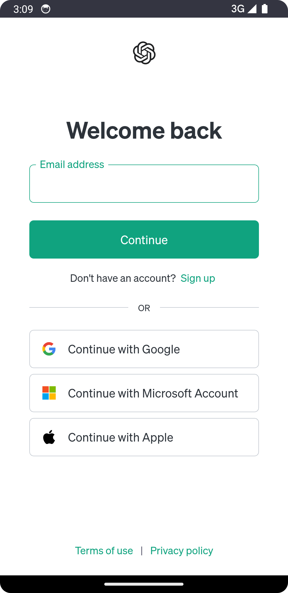

# ChatGPT App

## About

This (unofficial) app acts as a webview wrapper for [chat.openai.com](https://chat.openai.com).

Hey Hypers, Expect Additional features on this branch, from Ihype LLC. As always, Stay Hyped:)!

## Screenshot

 

## Installation

Download the latest release and install it on your device.
